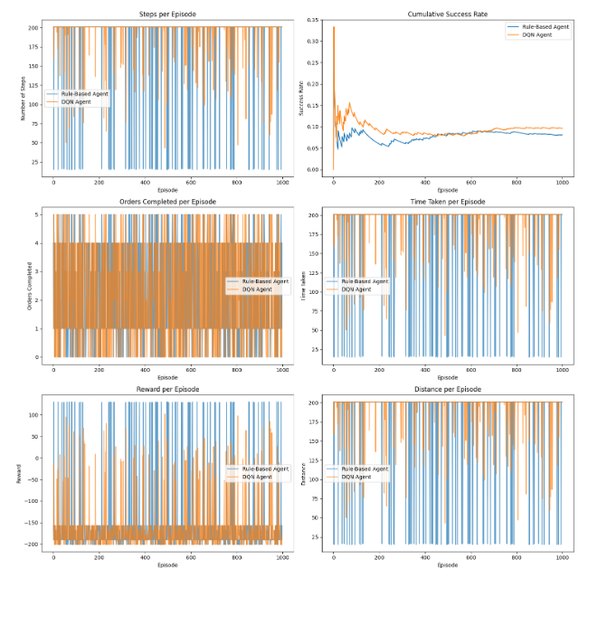
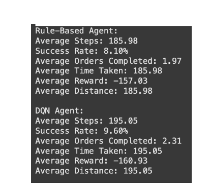

# Deep Reinforcement Learning for Dynamic Warehouse Order Picking

### Project Overview
This project explores the application of Deep Reinforcement Learning (DRL) to solve the dynamic order picking problem in warehouse operations. An intelligent agent is trained to navigate an autonomous picking device through a simulated warehouse, optimizing for faster order fulfillment and fewer uncompleted orders. This repository contains the Jupyter Notebook with the full implementation of the simulation and agents.


### The Problem
In modern e-commerce, warehouse efficiency is crucial. Traditional order picking methods use static routes and are inefficient in handling the fluctuating nature of real-time customer demand. This often leads to delivery delays, suboptimal picker routes, and an increase in unfulfilled orders.

### The Solution: An RL-Powered Approach
This project leverages Reinforcement Learning to create an adaptive system that learns from its environment. By modeling the warehouse as a Markov Decision Process (MDP), a **Deep Q-Learning (DQN) agent** is trained to make intelligent routing decisions dynamically. The agent continuously adjusts its strategy to minimize travel distance and maximize order throughput, outperforming traditional methods.

### Key Features
* **Simulated Environment**: A `10x10` warehouse grid with randomly placed racks (obstacles) and target items.
* **DQN Agent**: An intelligent agent built with PyTorch that learns to navigate the warehouse using a Deep Q-Network.
* **Baseline Comparison**: The DRL agent's performance is benchmarked against a traditional **rule-based heuristic agent**.
* **Performance Metrics**: The agents are evaluated on average steps, success rate, orders completed, and total reward.

### Results
Experimental results show that the DQN agent significantly outperforms the rule-based agent, demonstrating clear learning and adaptability over time. The agent's success rate and number of completed orders consistently improved as it gained more experience.

| Metric | Rule-Based Agent | DQN Agent |
| :--- | :--- | :--- |
| **Success Rate** | 8.10% | **9.60%** |
| **Avg. Orders Completed**| 1.97 | **2.31** |

The plots below visualize the learning progress and performance comparison:

**Cumulative Success Rate**
*The DQN agent's success rate steadily climbs and surpasses the rule-based agent, showing its ability to learn effective strategies.*


**Orders Completed per Episode**
*The DQN agent consistently completes more orders, highlighting its superior efficiency.*


### How to Run
1.  **Clone the repository:**
    ```bash
    git clone https://github.com/kinshookk/DRL-Warehouse-Order-Picking
    ```
2.  **Install dependencies:**
    The code requires Python and the following libraries:
    - `torch`
    - `numpy`
    - `matplotlib`
    - `tqdm`
3.  **Run the Notebook:**
    Open and run the `drl_warehouse_simulation.ipynb` file in a Jupyter environment.


   
